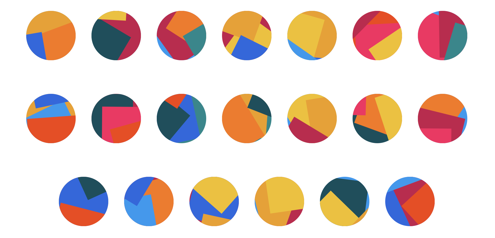

[](https://www.npmjs.com/package/ngx-jazzicon)    [](https://www.npmjs.com/package/ngx-jazzicon) [](https://github.com/Jamforce/ngx-jazzicon/blob/master/LICENSE)


# NgxJazzicon

Angular version of Jazzicon from danfinlay based on improvements by jmrossy.

> Say goodbye to boring blocky identicons that look like they came out of the 70s, and replace them with jazzy, colorful collages that more likely came out of the 80's




## Install

### NPM

Installing with npm is recommended and it works seamlessly with webpack.

```js
npm install ngx-jazzicon
```

## Quick start

### Global

To use in your project, add JazziconModule to app NgModule.

app.module

```js
import { JazziconModule } from 'ngx-jazzicon';

@NgModule({
  imports: [
    JazziconModule.forRoot()
  ],
  declarations: [AppComponent],
  bootstrap: [AppComponent]
})
export class AppModule {}
```

app.component

```html
<h1>Jazzicon is awesome</h1>
<ngx-jazzicon seed="12345"></ngx-jazzicon>
```


## Props

| Name          | Description          | Type         | Default        | Accepted values          |
| ------------- | -------------------- | ------------ | -------------- | ------------------------ |
| `seed`        | Seed for the icon    | `Number`     | Random Number  | Only positive integer    |
| `colors`      | Colors for icon      | `Array`      | See Below      | Array of Hex color code  |
| `diameter`    | Diameter of icon     | `Number`     | 100            | Positive integer         |
| `shapeCount`  | Number of shapes     | `Number`     | 4              | Positive integer         |

**Default Colors**

```
[
    '#01888C', // teal
    '#FC7500', // bright orange
    '#034F5D', // dark teal
    '#F73F01', // orangered
    '#FC1960', // magenta
    '#C7144C', // raspberry
    '#F3C100', // goldenrod
    '#1598F2', // lightning blue
    '#2465E1', // sail blue
    '#F19E02' // gold
]
```
**Global configuration**

Colors, diameter and shapeCount can be overridden in the global configuration to affect all jazzicon

app.module

```js
import { JazziconModule } from 'ngx-jazzicon';

@NgModule({
  imports: [
    JazziconModule.forRoot({
      colors: ['#42f5d7', '#5442f5', '#42a7f5', '#f5da42', '#f5428a', '#f57542'],
      diameter: 50,
      shapeCount: 5,
    })
  ],
  declarations: [AppComponent],
  bootstrap: [AppComponent]
})
export class AppModule {}
```

## License

[MIT](LICENSE) license.
